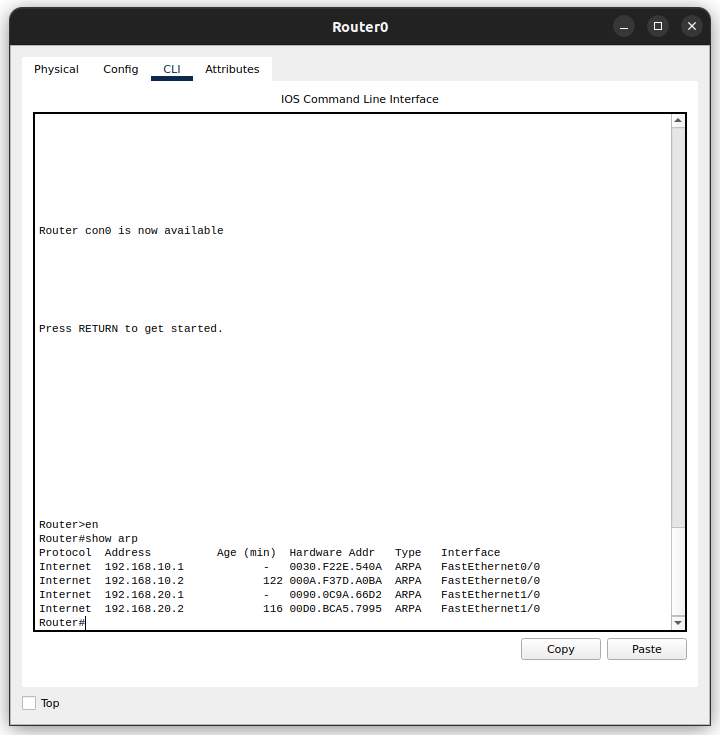

# Compte rendu du TP sur Packet Tracer

### Antonin Juquel, Raj Porus Hiruthayaraj


## Exercice 1
### Solution technique proposée


### Explication
- Router1 : Le routeur qui relie le LAN du Site 1 au WAN
  - Switch1 : Le switch qui relie les machines du premier sous-réseau au Router1
  - Switch2 : Le switch qui relie les machines du premier sous-réseau au Router1
- Router2 : Le routeur qui relie le LAN du Site 2 au WAN
  - Switch3 : Le switch qui relie les machines du deuxième sous-réseau du Routeur2
  - Switch4 : Le switch qui relie les machines du deuxième sous-réseau du Routeur2

En résumé, les switches permettent de connecter les machines dans chaque sous-réseau, tandis que les routeurs assurent la communication entre les sites via le WAN.

## Exercice 2

| Equipement | Interface       | Adresse IP/Masque              | Passerelle par défaut |
|------------|-----------------|--------------------------------|-----------------------|
| Router0    | FastEthernet0/0 | 192.168.10.1/24                |
|            | FastEthernet0/1 | 192.168.20.1/24                |    
|            | Serial2/0       | 192.168.30.1/24                |
| Router1    | FastEthernet0/0 | 192.168.40.1/24                |
|            | FastEthernet0/1 | 192.168.50.1/24                |
|            | Serial2/0       | 192.168.30.2/24                |
| PC0        | FastEthernet0   | 192.168.10.2/24                | 192.168.10.1          |
| PC1        | FastEthernet0   | 192.168.10.3/24                | 192.168.10.1          |
| PC2        | FastEthernet0   | 192.168.10.4/24                | 192.168.10.1          |
| PC3        | FastEthernet0   | 192.168.10.5/24                | 192.168.10.1          |
| PC4        | FastEthernet0   | 192.168.10.6/24                | 192.168.10.1          |
| PC5        | FastEthernet0   | 192.168.20.2/24                | 192.168.20.1          |
| PC6        | FastEthernet0   | 192.168.20.3/24                | 192.168.20.1          |
| PC7        | FastEthernet0   | 192.168.20.4/24                | 192.168.20.1          |
| PC8        | FastEthernet0   | 192.168.20.5/24                | 192.168.20.1          |
| PC9        | FastEthernet0   | 192.168.20.6/24                | 192.168.20.1          |
| PC10       | FastEthernet0   | 192.168.40.2/24                | 192.168.40.1          | 
| PC11       | FastEthernet0   | 192.168.40.3/24                | 192.168.40.1          |
| PC12       | FastEthernet0   | 192.168.40.4/24                | 192.168.40.1          |
| PC13       | FastEthernet0   | 192.168.40.5/24                | 192.168.40.1          |
| PC14       | FastEthernet0   | 192.168.40.6/24                | 192.168.40.1          |
| PC15       | FastEthernet0   | 192.168.50.2/24                | 192.168.50.1          |
| PC16       | FastEthernet0   | 192.168.50.3/24                | 192.168.50.1          |
| PC17       | FastEthernet0   | 192.168.50.4/24                | 192.168.50.1          |
| PC18       | FastEthernet0   | 192.168.50.5/24                | 192.168.50.1          |
| PC19       | FastEthernet0   | 192.168.50.6/24                | 192.168.50.1          |

## Exercice 3 : communication entre deux stations d’un même sous réseau

Un switch est nécessaire pour permettre la communication entre deux stations au sein d'un même sous-réseau. 

1. En utilisant "show interface", on peut voir les interfaces disponibles sur l'équipement, notamment les interfaces FastEthernet0/1 à FastEthernet0/24 et les interfaces GigabitEthernet0/1 et GigabitEthernet0/2, qui permettent d'établir une connexion Internet.
2. Lorsque qu'on entre la commande "show startup-config", on remarque que la NVRAM est vide et affiche le message "startup-config is not present". Cela s'explique par le fait qu'aucune configuration n'a été sauvegardée. 
3. Les caractéristiques par défaut d'une interface Fast Ethernet sont les suivantes :
    - Adresse MAC : 0001.63ce.0301
    - L'interface est inactive (éteinte)
    - La vitesse est de 100 Mbits/sec
    - Le mode de transmission est en Half-Duplex
- Pour activer une interface, il faut connecter l'interface du switch à une machine PC-PT.
4. Un câble droit est utilisé pour connecter un switch et un PC car ce sont des équipements de réseau de types différents.  
5. Une fois que les machines sont connectées au switch, on peut constater que les interfaces FastEthernet0/1 et 0/2 sont activées (« Line protocol on Interface FastEthernet0/1, changed state to up »). En tapant à nouveau la commande « show interface », on peut remarquer que les interfaces FastEthernet0/1 et 0/2 sont en activité (up).
6. On configure les PC en utilisant la commande « ip address » pour leur attribuer une adresse IP et un masque de sous-réseau conformément à la table de routage. On peut ensuite vérifier que les PC ont bien reçu une adresse IP en tapant la commande « ipconfig » sur chaque machine.

*Exemple :*


Pour tester la communication entre les PC, on utilise la commande « ping ».


On peut voir que les PC sont bien connectés au switch et peuvent communiquer entre eux.

7. En utilisant la commande "show mac-address-table", il est possible d'accéder à la table de commutation du switch et d'obtenir les informations qui y sont stockées.


## Exercice 4 : communication entre deux stations de sous réseaux différents

1. La connectivité à l'interieur du sous réseau fonctionne bien, mais il est impossible de communiquer avec les autres sous réseaux car les switchs ne sont pas connectés entre eux. Pour résoudre ce problème, on peut utiliser un routeur qui va permettre de connecter les différents sous réseaux entre eux.


2. Le contenu de la table de commutation du switch n'a pas changé car les switchs ne sont pas connectés entre eux.


3. Le fichier de configuration en cours d'exécution n'ait pas été modifié cela s'explique par le fait que les switches ne sont pas encore opérationnels.

## Exercice 5 : prise en main du routeur

1. On ajoute le Routeur-PT routeur0
2. Un câble droit est utilisé pour connecter un switch et un routeur car ce sont des équipements de réseau de types différents.
3. Le routeur n'étant pas encore configuré avec la commande "show" on observe aucun changement d'état de liens sur le routeur et sur le switch.
4. La commande "show running-config" permet d'afficher toutes les interfaces du routeur.


Le fichier de configuration actif est stocké dans la mémoire RAM.

5. La commande "show interface" permet d'afficher toutes les interfaces du routeur. On observe notamment les interfaces FastEthernet0/0, FastEthernet1/0, FastEthernet4/0 et FastEthernet5/0 pour les connexions Ethernet locales, et les interfaces Serial2/0 et Serial3/0 pour les connexions WAN à plus grande distance.
6. 
- À l'aide de la commande "show interface FastEthernet0/0", voici les caractéristiques de l'interface FastEthernet0/0 :
  - État : inactif (« administratively down »)
  - Bande passante : 100 000 kbits
  - MTU : 1500 octets
  - Délai : 100 microsecondes
  - Encapsulation : ARPA 


- À l'aide de la commande "show interface Serial2/0", voici les caractéristiques d'une interface Serial2/0 :
  - État : inactif (« administratively down »)
  - Bande passante : 128Kbits
  - MTU : 1500 octets
  - Délai : 20 000 microsecondes
  - Encapsulation : HDLC


7. Notre routeur est configuré pour prendre en charge les protocoles ARP et IP.
8. La table de routage est un tableau qui permet de déterminer les destinations de paquets de données circulant sur un réseau en utilisant différentes adresses. La table ARP est utilisée par les hôtes pour accéder aux adresses MAC des autres ordinateurs. Cette table permet d'associer une adresse IP avec une adresse MAC.
9. Notre table ARP est vide car nous n'avons pas encore configuré notre routeur. "show arp"


Idem pour la table de routage. "show ip route"


## Exercice 6 : communication entre deux stations de sous réseaux différents
1. Les commandes suivantes ont été saisies pour configurer l'interface FastEthernet0/0 et l'interface FastEthernet1/0 :
```arduino
Router#configure terminal
Router(config)#interface FastEthernet0/0
Router(config-if)#ip address 192.168.10.1 255.255.255.0
Router(config-if)#no shutdown
exit
Router(config)#interface FastEthernet1/0
Router(config-if)#ip address 192.168.20.1 255.255.255.0
Router(config-if)#no shutdown
```

2. La configuration est maintenant opérationnelle comme le montre les commandes "show running-config" et "show ip route". 


3. On a toujours le même résultat quand on lance la commande "show startup-config". Cela s'explique par le fait que la configuration n'a pas encore été enregistrée dans la mémoire flash.


4. On enregistre la configuration opérationnelle dans la mémoire flash avec la commande "copy running-config startup-config". On peut voir que la configuration est maintenant enregistrée dans la mémoire flash.


5. La communication entre deux machines de sous-réseaux différents ne fonctionne pas car les passerelles n'ont pas encore été configurées sur chaque machine.


6. On affiche la nouvelle table ARP avec la commande "show arp". On peut voir que les adresses MAC des machines ont été ajoutées dans la table ARP du routeur.



## Exercice 7 : configuration de la liaison série entre deux routeurs 
1. À l'aide de la commande "sh controller Serial2/0" sur chaque routeur on identifie que la liaison DTE-DCE est configurée sur le routeur 0 et la liaison DCE-DTE est configurée sur le routeur 1.


2. Il est nécessaire d'avoir une partie DCE (Data Communications Equipment) et une partie DTE (Data Terminal Equipment) dans le câble pour permettre la connexion entre les deux routeurs. La partie DCE fournit l'horloge pour la transmission des données tandis que la partie DTE est l'équipement terminal qui envoie et reçoit les données. Cette configuration permet d'assurer une synchronisation précise entre les équipements et de minimiser les erreurs de transmission de données.
3. 
- On configure l'adresse Ip sur l'interface Serial2/0 du routeur 0 de la manière suivante:
  - Adresse IP : 192.168.30.1
  - Masque de sous-réseau : 255.255.255.0

- On configure l'adresse Ip sur l'interface Serial2/0 du routeur 1 de la manière suivante:
  - Adresse IP : 192.168.30.2
  - Masque de sous-réseau : 255.255.255.0 
4. Configurez l’ensemble des points liés au fait d’avoir une partie DTE et une partie DCE sur votre câble (horloge, encapsulation niveau 2, ...).  
5.   
6. 
On configure les route static sur les deux routeurs pour permettre la communication entre les deux sous-réseaux.  


7. On vérifie la connectivité entre PC10 et PC0 avec la commande "ping 192.168.10.2" depuis le terminal de PC10. On peut voir que la communication fonctionne.


On remarque que les tables ARP du routeur 0 et routeur 1 n'ont pas changées


8. On vérifie les tables de routage des deux routeurs avec la commande "show ip route". On peut voir que les deux routeurs ont bien appris la route vers le sous-réseau


 
