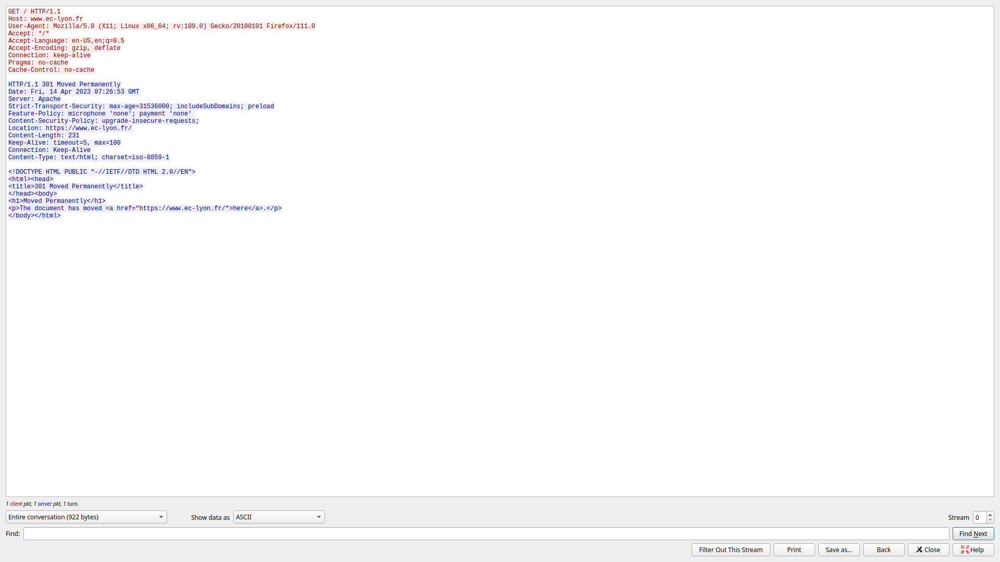
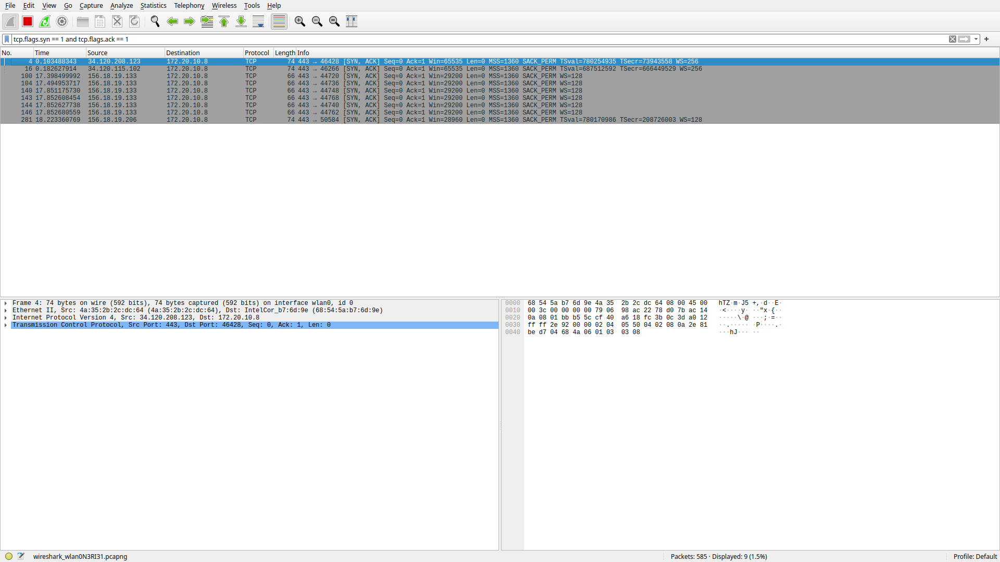
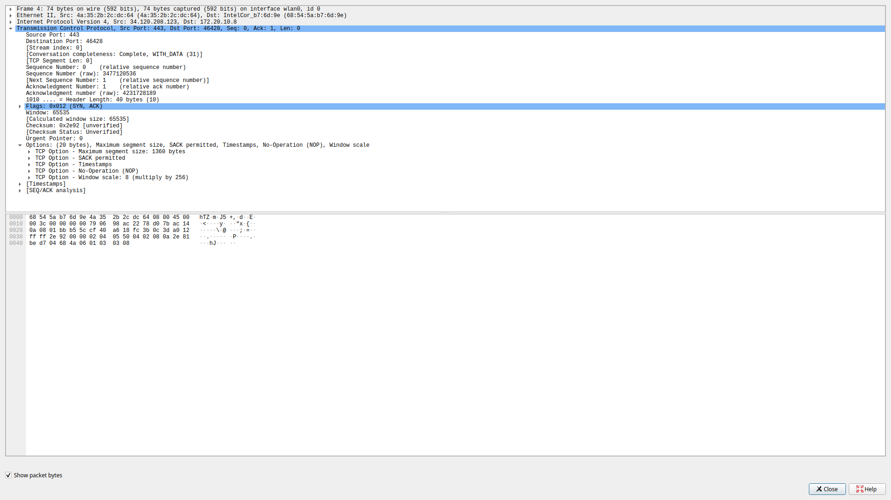
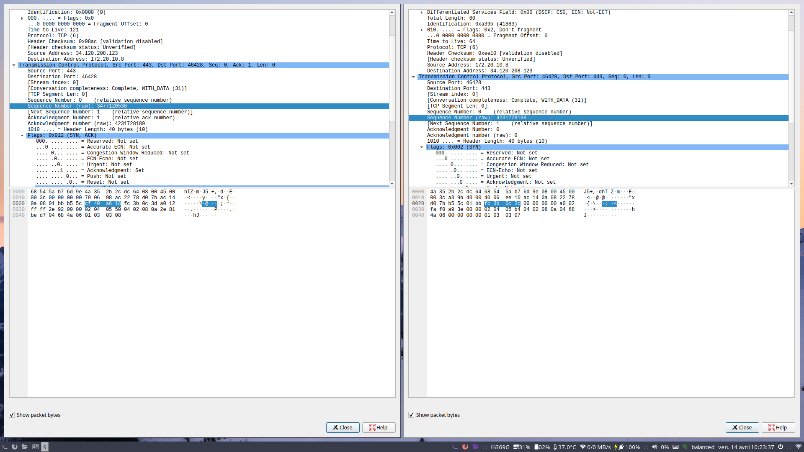

# Rapport du TP 2 : Wireshark

## HTTP Session 

On identifie l'interface qu'on utilise, en l'occurence sous linux, la command "ip a" donne la liste des interfaces.
On choisi wlan0, car je suis connecté en Wi-Fi.

Avec la commande ci-dessus on ouvre wireshark en spécifiant l'interface, et on le sélectionne lors du démarrage.

En triant avec les protocoles et en regardant les échanges DNS, on trouve que l'ip du serveur du serveur web est : 156.18.19.133

L'IP de la machine avec laquelle on échange les données de la page web est aussi : 156.18.19.133

Ces échanges sont effectué grace au protocole HTTP.

On compte 11 connections TCP :

Le diagramme pour les échanges au niveau du protocole http entre le client et le serveur nous avons  cela :

La méthode HTTP utilisée pour télécharger la page Web est "GET".

Le code de retour du serveur est "301 Moved Permanently". Cela signifie que la ressource demandée a été déplacée de manière permanente vers un nouvel emplacement.

Les informations spécifiées par le client (le navigateur) sont les suivantes :

User-Agent: Mozilla/5.0 (X11; Linux x86_64; rv:109.0) Gecko/20100101 Firefox/111.0
Accept: */*
Accept-Language: en-US,en;q=0.5
Accept-Encoding: gzip, deflate
Connection: keep-alive
Pragma: no-cache
Cache-Control: no-cache

La taille de la réponse est de 231 octets. La version du protocole utilisée par le serveur est "HTTP/1.1".

## TCP

Toutes les connexions TCP établies entre le client et le serveur sont les suivantes :

Le numéro de port source dans l'en-tête TCP est 443, tandis que le numéro de port de destination est 46428.

On l'obtient grace au filtre : tcp.flags.syn == 1 and tcp.flags.ack == 1

Le protocole TCP utilise un mécanisme en trois étapes appelé "Three-way handshake" pour établir une connexion fiable entre deux hôtes sur un réseau.
- SYN : Le client envoie un paquet SYN (synchronisation) au serveur
- SYN-ACK : Le serveur répond avec un paquet SYN-ACK
- ACK : Le client envoie un paquet ACK

Lorsque le client et le serveur échangent les commandes SYN pour établir une connexion TCP, ils se communiquent des informations importantes pour cette connexion, comme les numéros de port source et destination, le numéro de séquence initial (ISN) et la quantité maximale de données qui peuvent être envoyées dans un seul paquet (appelé MSS).

Le numéro de séquence initial (ISN) côté serveur est 3477120536 et le MSS est 1360 bytes
Et côté client le MSS 1460 bytes et l'ISN est 4231728188.

