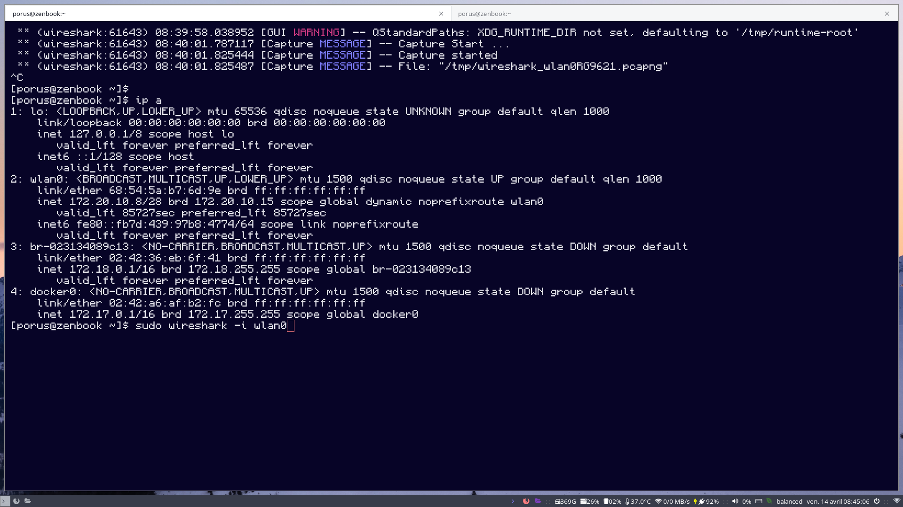
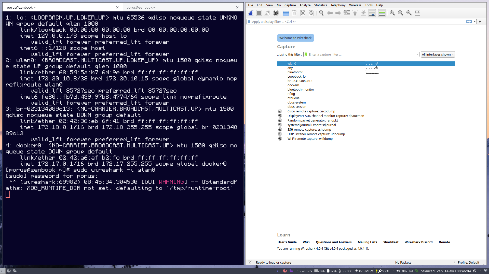
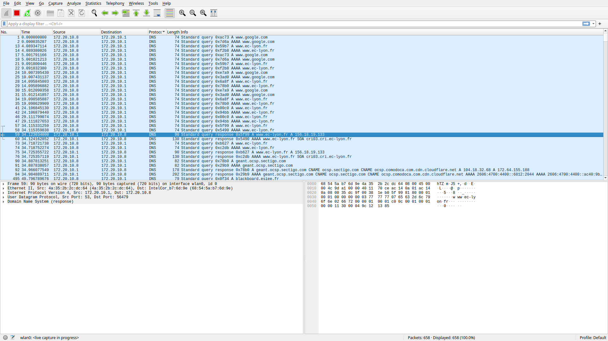
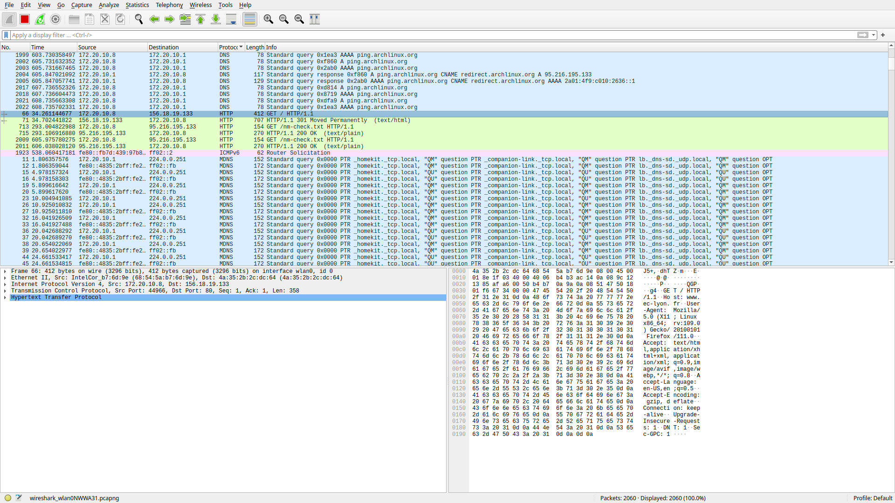
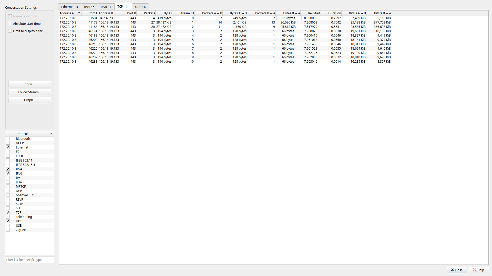

# Rapport du TP 2 : Wireshark

## HTTP Session 

On identifie l'interface qu'on utilise, en l'occurence sous linux, la command "ip a" donne la liste des interfaces.
On choisi wlan0, car je suis connecté en Wi-Fi.

Avec la commande ci-dessus on ouvre wireshark en spécifiant l'interface, et on le sélectionne lors du démarrage.

En triant avec les protocoles et en regardant les échanges DNS, on trouve que l'ip du serveur du serveur web est : 156.18.19.133

L'IP de la machine avec laquelle on échange les données de la page web est aussi : 156.18.19.133

Ces échanges sont effectué grace au protocole HTTP.

On compte 11 connections TCP :

