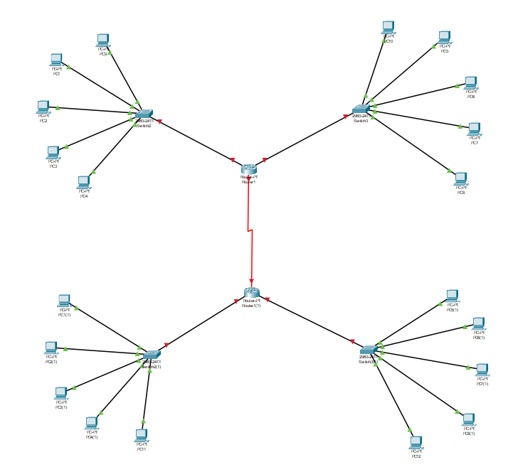

# Compte rendu de tp

## Exercice 1
### Solution technique proposée

### Explication
- Router1 : Le routeur qui relie le LAN du Site 1 au WAN
  - Switch1 : Le switch qui relie les machines du premier sous-réseau au Router1
  - Switch2 : Le switch qui relie les machines du premier sous-réseau au Router1
- Router2 : Le routeur qui relie le LAN du Site 2 au WAN
  - Switch3 : Le switch qui relie les machines du deuxième sous-réseau du Routeur2
  - Switch4 : Le switch qui relie les machines du deuxième sous-réseau du Routeur2

En résumé, les switches permettent de connecter les machines dans chaque sous-réseau, tandis que les routeurs assurent la communication entre les sites via le WAN.

## Exercice 2

Equipement	Interface	Adresse IP/Masque	Passerelle par défaut
Router1	Interface WAN	Public IP	-
Interface LAN1-SR1	192.168.10.1/24	-
Interface LAN1-SR2	192.168.10.2/24	-
Switch1	Interface VLAN1-SR1	192.168.10.11/24	192.168.10.1
Interface VLAN2-SR1	192.168.10.12/24	192.168.10.1
Switch2	Interface VLAN1-SR2	192.168.10.21/24	192.168.10.2
Interface VLAN2-SR2	192.168.10.22/24	192.168.10.2
Router2	Interface WAN	Public IP	-
Interface LAN2-SR3	192.168.20.1/24	-
Interface LAN2-SR4	192.168.20.2/24	-
Switch3	Interface VLAN1-SR3	192.168.20.11/24	192.168.20.1
Interface VLAN2-SR3	192.168.20.12/24	192.168.20.1
Switch4	Interface VLAN1-SR4	192.168.20.21/24	192.168.20.2
Interface VLAN2-SR4	192.168.20.22/24	192.168.20.2
Router1	Interface LAN1-LAN2	192.168.30.1/24	-
Router2	Interface LAN2-LAN1	192.168.30.2/24	-
